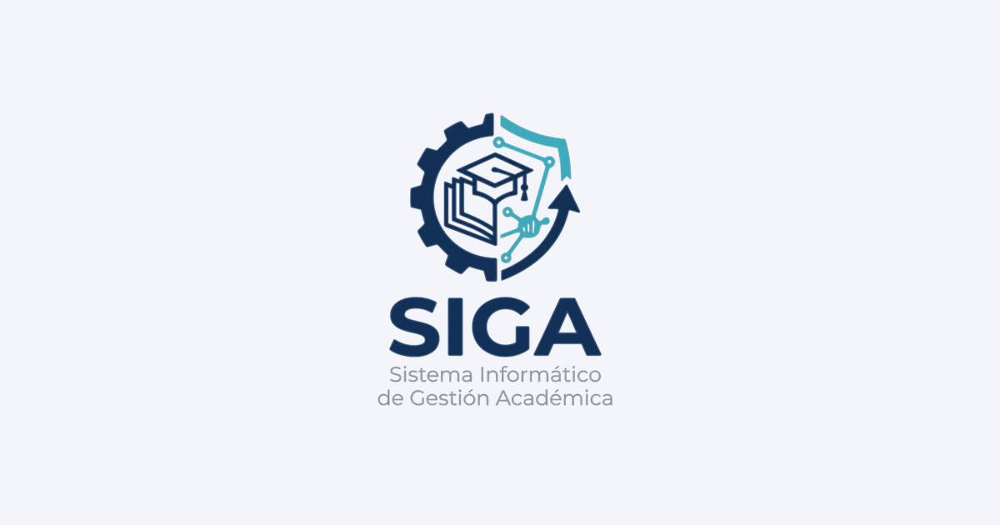

# SIGA — Sistema Informático de Gestión Académica

SIGA es una aplicación web para la detección temprana del riesgo de deserción universitaria. Permite monitorear la trayectoria académica de los estudiantes y dar seguimiento a los casos en riesgo mediante tickets asignados a mentores y coordinadores académicos.



## Características

- **Dashboard de estudiantes**: tabla con niveles de riesgo, filtros y búsqueda para identificar con rapidez los casos que requieren atención.
- **Detalle de estudiante**: trayectoria académica, participación y autopercepción en una vista consolidada.
- **Tickets de seguimiento**: creación y listado de tickets asignados a mentores para gestionar el acompañamiento de cada estudiante.
- **Autenticación**: acceso restringido mediante inicio de sesión.
- **Tema claro/oscuro**: interfaz adaptable a la preferencia del usuario.

> Nota: SIGA es un MVP. Los datos de estudiantes y tickets son datos de prueba (mock) y se persisten en el localStorage del navegador; no hay backend ni API real.

## Stack tecnológico

- **React 19** con **TypeScript**
- **Vite** como herramienta de build y desarrollo
- **Tailwind CSS 4** y **shadcn/ui** (Radix UI) para la interfaz
- **TanStack Router**, **TanStack Query** y **TanStack Table** para ruteo, manejo de datos y tablas
- **React Hook Form** con **Zod** para formularios y validación
- **Zustand** para el estado global, con persistencia en localStorage

## Puesta en marcha

Requisitos previos: **Node.js 24+** y **pnpm**.

```bash
# Clonar el repositorio
git clone https://github.com/thiagov2a/siga-app.git
cd siga-app

# Instalar dependencias
pnpm install

# Levantar el servidor de desarrollo (http://localhost:5173)
pnpm dev

# Generar el build de producción
pnpm build

# Ejecutar el linter
pnpm lint

# Verificar el formato con Prettier
pnpm format:check
```

## Estructura del proyecto

```
src/
├── features/
│   ├── students/   # Dashboard de estudiantes y detalle individual
│   ├── tickets/    # Creación y listado de tickets de seguimiento
│   ├── auth/       # Autenticación (inicio de sesión)
│   └── errors/     # Páginas de error
├── stores/
│   └── students-store.ts  # Estado de estudiantes y tickets (Zustand + localStorage)
└── components/     # Componentes compartidos de UI
```

## Créditos

SIGA se construyó sobre la plantilla [shadcn-admin](https://github.com/satnaing/shadcn-admin) de [@satnaing](https://github.com/satnaing), utilizada bajo licencia MIT.

## Licencia

Distribuido bajo la licencia [MIT](https://choosealicense.com/licenses/mit/).
